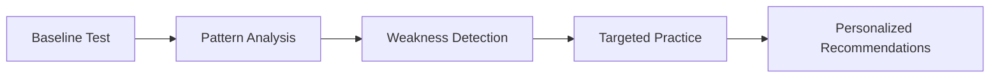

<div align="center">
  
# 🎹 layoutgod

### *Become a Layout God*

[](https://reactjs.org/)
[](https://www.typescriptlang.org/)
[](https://nodejs.org/)
[](https://tailwindcss.com/)
[](https://opensource.org/licenses/MIT)

**Analyze. Compare. Optimize. Master your keyboard layout with scientific precision.**

[🚀 Quick Start](#-quick-start) • [✨ Features](#-features) • [📊 Metrics](#-analysis-metrics) • [🛠️ Tech Stack](#️-tech-stack) • [📖 Documentation](#-api-reference)

</div>

---

## 🎯 Overview

**layoutgod** is a revolutionary keyboard layout analysis platform that combines advanced computational linguistics, biomechanical modeling, and statistical analysis to provide the most comprehensive keyboard layout evaluation available. Built on the foundation of cyanophage's analyzer methodology, this platform extends far beyond traditional analyzers with **17+ sophisticated metrics**, real-time adaptive testing, and AI-powered recommendations.

### 🌟 Why layoutgod?

<table>
<tr>
<td width="50%">

**🧠 Advanced Analysis**
- 27+ comprehensive metrics
- Real-world frequency data
- Biomechanical modeling
- Pattern recognition algorithms

</td>
<td width="50%">

**⚡ Modern Experience**
- Sub-100ms response times
- Real-time visual feedback
- Dark/light mode support
- Mobile-responsive design

</td>
</tr>
<tr>
<td width="50%">

**🎯 Personalization**
- Adaptive typing tests
- Custom recommendations
- Custom layout analysis
- Layout gallery

</td>
<td width="50%">

**🛠️ Professional Tools**
- Layout designer
- Import/export formats
- Comparison engine

</td>
</tr>
</table>

---

## ✨ Features

### 🔍 **Comprehensive Layout Analysis**
Evaluate any keyboard layout with our scientific analysis engine that examines:

- **Effort & Distance** - Total finger strain and travel distance
- **Bigram Patterns** - Same-finger sequences and awkward transitions  
- **Flow Metrics** - Rolls, alternation, and natural typing rhythm
- **Ergonomic Factors** - Pinky usage, lateral stretches, and hand balance
- **Advanced Patterns** - Trigram redirects, skip bigrams, and more

### 🧪 **Revolutionary Adaptive Testing**

Our 5-stage adaptive typing test learns from your performance:



1. **Baseline Assessment** - Establish your current performance
2. **Pattern Recognition** - Identify typing patterns
3. **Weakness Detection** - Find problematic finger combinations
4. **Dynamic Adaptation** - Generate text targeting weaknesses
5. **Smart Recommendations** - Get personalized layout suggestions

### 🎨 **Beautiful Modern Interface**

<details>
<summary>View Interface Features</summary>

- ✅ **Responsive Design** - Perfect on any device
- ✅ **Dark/Light Modes** - Automatic theme detection
- ✅ **Interactive Visualizations** - Real-time charts and heatmaps
- ✅ **Smooth Animations** - 60fps transitions
- ✅ **Accessibility First** - WCAG 2.1 compliant

</details>

---

## 📊 Analysis Metrics

Our analysis engine evaluates layouts across 17+ scientific metrics:

| Category | Metrics | Impact |
|----------|---------|--------|
| **⚡ Efficiency** | • Effort Score<br>• Travel Distance<br>• Home Row Usage | Speed & Fatigue |
| **🎹 Flow** | • Inward/Outward Rolls<br>• Hand Alternation<br>• Trigram Patterns | Typing Rhythm |
| **🚫 Penalties** | • Same Finger Bigrams<br>• Lateral Stretches<br>• Pinky Scissors | Error Rate |
| **⚖️ Balance** | • Finger Load Distribution<br>• Hand Balance<br>• Row Distribution | Long-term Comfort |

<details>
<summary><b>📈 View Detailed Metric Descriptions</b></summary>

### Primary Metrics

- **Effort** - Weighted finger strain calculation based on key positions
- **Distance** - Total finger travel distance over representative text
- **SFBs** - Percentage of consecutive same-finger key presses
- **Rolls** - Natural inward/outward finger movements
- **Alternation** - Hand switching frequency for rhythm

### Advanced Metrics

- **Lateral Stretch** - Uncomfortable sideways finger reaches
- **Pinky Scissors** - Awkward pinky-ring finger combinations
- **Skip Bigrams** - Same finger, non-adjacent keys (e.g., 'ec')
- **Two Row Jumps** - Large vertical finger movements
- **Trigram Redirects** - Direction changes in 3-key sequences
- **Column 5-6 Usage** - Center column accessibility
- **Off-Home Percentage** - Time fingers spend away from home row

</details>

---

## 🚀 Quick Start

### Prerequisites

```bash
# Required
Node.js 16.0+
npm or yarn

# Optional
Git (for cloning)
```

### ⚡ One-Command Installation

```bash
# Clone, install, and run everything
git clone https://github.com/rishikdulipyataGH/layoutgod.git && cd layoutgod && npm install && npm run dev
```

### 📝 Manual Installation

<details>
<summary>Step-by-step instructions</summary>

1. **Clone the repository**
   ```bash
   git clone https://github.com/rishikdulipyataGH/layoutgod.git
   cd layoutgod
   ```

2. **Install dependencies**
   ```bash
   # Install all dependencies (uses workspaces)
   npm install
   ```

3. **Initialize database** (optional - auto-created)
   ```bash
   npm run migrate  # Optional: run migrations
   npm run seed     # Optional: adds sample layouts
   ```

4. **Start development servers**
   ```bash
   npm run dev
   ```

</details>

### 🌐 Access Points

Once running, access the application at:

| Service | URL | Description |
|---------|-----|-------------|
| 🎨 **Frontend** | [http://localhost:3000](http://localhost:3000) | Main application |
| 🔧 **Backend API** | [http://localhost:3001](http://localhost:3001) | REST API server |
| 💚 **Health Check** | [http://localhost:3001/health](http://localhost:3001/health) | Server status |

---

## 🛠️ Tech Stack

### Architecture Overview

```
┌────────────────────────────────────────┐
│         🎨 Frontend Layer              │
│    React 18 + TypeScript + Tailwind    │
└────────────────┬───────────────────────┘
                 │
┌────────────────▼───────────────────────┐
│         🔧 API Layer                   │
│    Express.js + RESTful Endpoints      │
└────────────────┬───────────────────────┘
                 │
┌────────────────▼───────────────────────┐
│         🧠 Analysis Engine             │
│    Advanced Pattern Recognition        │
└────────────────┬───────────────────────┘
                 │
┌────────────────▼───────────────────────┐
│         💾 Data Layer                  │
│    SQLite + Cached Results             │
└────────────────────────────────────────┘
```

### Technology Details

<details>
<summary>View complete tech stack</summary>

#### Frontend
- **React 18.2** - UI framework with hooks and concurrent features
- **TypeScript 4.9** - Type safety and better DX
- **Tailwind CSS 3.3** - Utility-first styling
- **React Router 6** - Client-side routing
- **Recharts** - Data visualization
- **Lucide React** - Modern icon library

#### Backend
- **Node.js** - JavaScript runtime
- **Express.js** - Web application framework
- **SQLite** - Embedded database
- **Socket.io** - Real-time communication
- **Custom Analyzers** - Proprietary analysis algorithms

#### Development
- **Concurrently** - Run multiple processes
- **Nodemon** - Auto-restart on changes
- **ESLint** - Code linting
- **Prettier** - Code formatting

</details>

## 🔌 API Reference

### Core Endpoints

| Method | Endpoint | Description |
|--------|----------|-------------|
| `GET` | `/api/layouts` | List all layouts with filters |
| `GET` | `/api/layouts/:slug` | Get specific layout details |
| `POST` | `/api/layouts` | Create new layout |
| `POST` | `/api/analysis/analyze` | Analyze layout without saving |
| `GET` | `/api/analysis/recommendations/:id` | Get personalized recommendations |

<details>
<summary><b>📚 View Complete API Documentation</b></summary>

### Layout Endpoints

#### GET /api/layouts
Retrieve all layouts with optional filtering and pagination.

```javascript
// Query Parameters
?type=standard        // Filter by layout type
?search=dvorak       // Search by name/description
?limit=20           // Results per page (default: 50)
?offset=0          // Pagination offset

// Response Example
[
  {
    "id": 1,
    "name": "QWERTY",
    "slug": "qwerty",
    "type": "standard",
    "effort": 1.832,
    "same_finger_bigrams_pct": 6.12,
    "roll_in_pct": 12.5,
    // ... additional metrics
  }
]
```

#### POST /api/analysis/analyze
Analyze a layout configuration without persisting.

```javascript
// Request Body
{
  "layout_data": {
    "keys": {
      "q": "q", "w": "w", "e": "e", // ... complete mapping
    }
  }
}

// Response
{
  "stats": {
    "effort": 1.245,
    "distance": 892.3,
    // ... all metrics
  },
  "recommendations": [
    {
      "priority": "high",
      "category": "ergonomics",
      "description": "High pinky usage detected"
    }
  ],
  "score": 85.5
}
```

</details>

---

## 🚦 Development Commands

| Command | Description |
|---------|-------------|
| `npm run dev` | Start both frontend & backend in dev mode |
| `npm run client:dev` | Start only frontend (port 3000) |
| `npm run server:dev` | Start only backend (port 3001) |
| `npm run build` | Build production bundle |
| `npm run test` | Run test suite |
| `npm run migrate` | Run database migrations |
| `npm run seed` | Seed database with sample data |

---

## 🐛 Troubleshooting

<details>
<summary><b>Common Issues & Solutions</b></summary>

### Port Already in Use
```bash
# Windows
netstat -ano | findstr :3000
taskkill /PID <PID> /F

# Mac/Linux
lsof -ti:3000 | xargs kill
```

### Database Locked
```bash
# Reset database
cd server
rm data/*.db
npm run migrate
npm run seed
```

### Module Not Found
```bash
# Clear cache and reinstall
npm cache clean --force
rm -rf node_modules package-lock.json
rm -rf client/node_modules client/package-lock.json
rm -rf server/node_modules server/package-lock.json
npm install
```

### Permission Denied
- Run terminal as Administrator (Windows)
- Use `sudo` for commands (Mac/Linux)
- Check antivirus isn't blocking Node.js

For detailed troubleshooting, see [STARTUP_INSTRUCTIONS.md](./STARTUP_INSTRUCTIONS.md)

</details>

---

### Development Guidelines

- Follow existing code style
- Add tests for new features
- Update documentation
- Keep commits atomic and descriptive

---

## 📄 License

This project is licensed under the MIT License - see the [LICENSE](LICENSE) file for details.

---

## 🙏 Acknowledgments

- 📊 **[Cyanophage](https://github.com/cyanophage)** - For the comprehensive layout analysis methodology
- ⌨️ **Mechanical Keyboard Community** - For continuous feedback and testing
- 📚 **Research Papers** - Academic foundations for biomechanical modeling

---

<div align="center">

### 👨‍💻 Created by **Rishik Dulipyata**

[](https://www.linkedin.com/in/rishikdulipyata/)
[](https://github.com/rishikdulipyataGH)

---

**⭐ Star this repo if you find it helpful!**

*Last updated: 2025*

</div>
